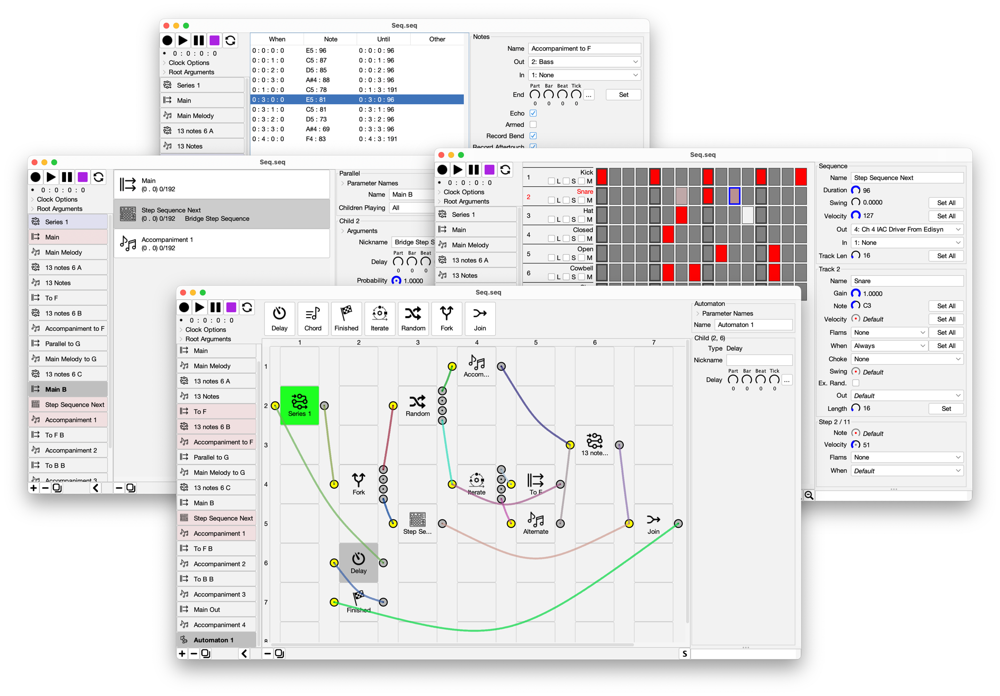

# Seq  
A Modular, Hierarchical Music Sequencer (Version 5)

By Sean Luke (sean@cs.gmu.edu)  
With Help from Filippo Carnovalini (filippo.carnovalini@vub.be)  
Copyright 2024, 2025 by Sean Luke and George Mason University

Related projects:  

* [Edisyn](https://github.com/eclab/edisyn), a patch editor toolkit with sophisticated exploration tools.
* [Flow](https://github.com/eclab/flow), a fully-modular, polyphonic, additive software synthesizer.
* [Gizmo](https://cs.gmu.edu/~sean/projects/gizmo/), an Arduino-based MIDI Swiss Army knife.
* [Arduino Firmware](https://github.com/eclab/grains) (oscillators, modulators, etc.) for the AE Modular Grains module.  Includes an ultralight but full-featured [MIDI library for small microcontrollers](https://github.com/eclab/grains/tree/main/midi).
* [*Computational Music Synthesis*](https://cs.gmu.edu/~sean/book/synthesis/), an open-content book on building software synthesizers.

## Donations

Donations are welcome via Paypal to Sean's address (sean@cs.gmu.edu).

## About

Seq is a very unusual MIDI sequencer.  In Seq, you write chunks of music, then remix, combine, and modify them in various ways, then remix the remixes, and so on, until you reach a final song. Seq has many ways to combine stuff, everything from simple ordered series to complex networks (automata).

Seq is written in pure Java.  It runs on MacOS, Linux, and Windows.

This is an early release of Seq, and it's got lots of wires sticking out here and there, is missing important items, and has bugs. But it works!  **Send us feedback!**

## Publications on Seq 

[A Hierarchical, Modular Sequencer](https://cs.gmu.edu/~sean/papers/audiomostly24.pdf).  With Filippo Carnovalini. Presented at Audio Mostly 2024.

## Manual

* Seq has an [initial manual](https://cs.gmu.edu/~eclab/projects/seq/seq.pdf) which explains the basics of using it.

* Interested in helping out on Seq?  Get ahold of us! Sean's email address is on the front page of the manual.

## Install and Run Seq

Seq is cross-platform and will run on a variety of platforms (Windows, Linux) but we are personally developing on and for MacOS and Linux. We'd appreciate feedback and screenshots of it running on Windows so we can tweak things.

### Installation and Running on MacOS

First install Seq from this link: [Seq.dmg](https://cs.gmu.edu/~eclab/projects/seq/Seq.dmg). 
Sadly, it's a whopping 60MB because it includes the Java VM.  :-(

MacOS has lately locked down the ability to run an application that's not from a commercial, paying Apple Developer.  And GMU is not one.  So you will have to instruct Sierra to permit Seq to run.

Try out the [demo song](https://github.com/eclab/seq/tree/main/songs) in the Seq repository.  You might also download [Flow](https://github.com/eclab/flow), a synthesizer for that song (see the demo1.flow patch file).

#### Installing under MacOS X Prior to Sequoia

This is pretty easy. CONTROL-Click on Seq's App Icon, and while holding Control down, select "Open".  Now instead of telling you that Seq cannot be opened because it's from an unidentified developer, you'll be given the option to do so. You probably will only have to do this once.

#### Installing under MacOS X Sequoia and Later

Apple has made this much more annoying now, to everyone's consternation.  You'll have to use the Terminal program.  Let's assume you stuck Seq in the /Applications directory as usual.  Now we have to tell Gatekeeper to allow Seq to run on your machine:

1. Run the Terminal Program (in /Applications/Utilities/)
2. Type the following command and hit RETURN: `   sudo xattr -cr /Applications/Seq.app`
4. Enter your password and hit RETURN
5. Quit the Terminal Program

Now you should be able to run Seq.  You only have to do this once.  This should work with earlier versions of OS X too. 

You can also run Seq from its jar file from the command line: see "Running from the command line" at end of these instructions. 

#### Rosetta and the M1

At present Seq only runs under Rosetta on the M1, because its package contains an Intel-only Java VM (because of my strange Mac setup, sorry).  If you have installed Java yourself, you can run Seq from the command line (see later below) and it'll probably run natively.  But Rosetta is generally fine.

### Installation and Running on Windows

**WARNING**: Seq's binaries have not been tested on Windows yet, and we won't be able to test them ourselves until late August.  If you are having difficulties, please let us know.  And try Seq on MacOS, where its binaries have been well tested!

The following should work (but has not been tested):

1. [Download and install at least Java 20](https://www.oracle.com/technetwork/java/javase/downloads).  The JRE should work fine.  Earlier versions of Java have a bug which causes Java apps (like Seq) to make teeny tiny windows on the latest high-resolution screens.

2. Download Seq's jar file, called [seq.jar](https://cs.gmu.edu/~eclab/projects/seq/seq.jar).

3. Double-click on seq.jar to launch Seq.

4. See **Running from the command line** below for more glitch-free options.

Try out the [demo song](https://github.com/eclab/seq/tree/main/songs) in the Seq repository.  You might also download [Flow](https://github.com/eclab/flow), a synthesizer for that song (see the demo1.flow patch file).

#### Note

Seq makes heavy use of Java preferences.  There is a longstanding Java/Windows bug which breaks Java preferences and will cause Seq to be unable to make any of your preferences persistent.  As of Java 11 the bug should be fixed, but if it's not, please let us know.

### Installation and Running on Linux

**WARNING**: Seq's binaries have not been tested on Linux yet, and we won't be able to test them ourselves until late August.  If you are having difficulties, please let us know.  And try Seq on MacOS, where its binaries have been well tested!

Seq should work fine if you have installed at least *Java 20*.

1. Install at least Java 20 (openjdk).

2. Download Seq's jar file, called [seq.jar](https://cs.gmu.edu/~eclab/projects/seq/seq.jar).

3. You'll need to figure out how to make it so that double-clicking on the jar file launches it in java.  In Ubuntu, here's what you do: right-click on the jar file icon and choose "Properties".  Then select the "Open With" tab, and select your Java VM (for example "Open JDK Java 8 Runtime").  The press "Set as Default".  This makes the Java VM the default application to launch jar files.

4. Thereafter you should be able to just double-click on the file to launch Seq.

6. See **Running from the command line** below for more glitch-free options.

Try out the [demo song](https://github.com/eclab/seq/tree/main/songs) in the Seq repository.  You might also download [Flow](https://github.com/eclab/flow), a synthesizer for that song (see the demo1.flow patch file).

### Running from the command line (MacOS, Windows, Linux)

1. Make sure Java 20 or later installed.

2. Download Seq's jar file, called [seq.jar](https://cs.gmu.edu/~eclab/projects/seq/seq.jar).

3. Run Seq as:   `java -jar seq.jar`

